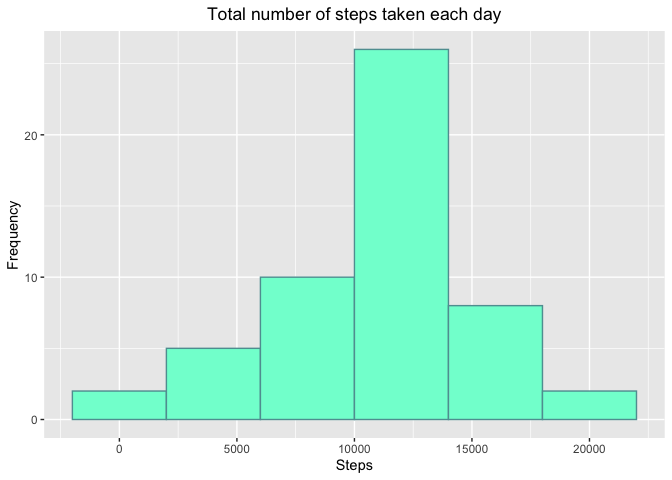
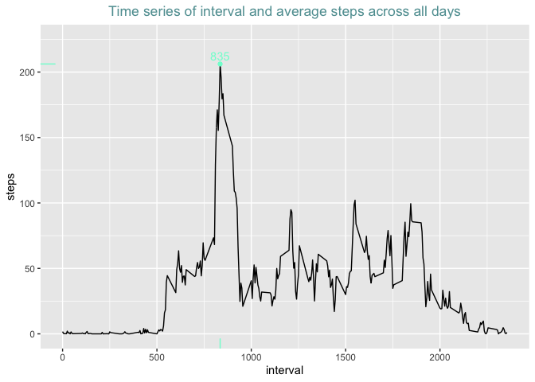
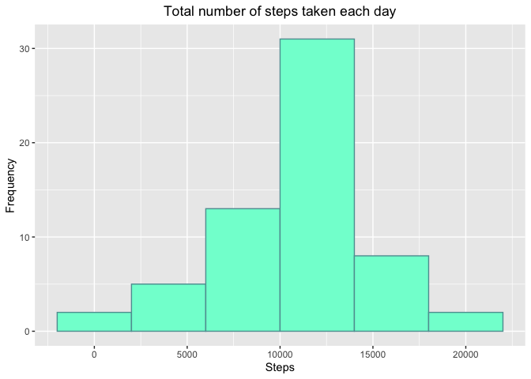
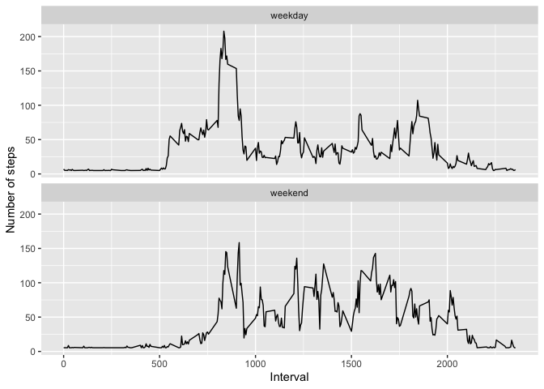

## Loading and preprocessing the data  
The code for unzip and load the data is described below, such as all the needed libraries.  

```r
library(ggplot2)
library(dplyr)
library(ggpmisc)
library(lubridate)

unzip("activity.zip")
df <- read.csv("activity.csv", sep = ",", na.strings = "NA")
```

It's interesting to understand how the data is presented, so I show here a summary table.  

```
## 
## 
##          steps                date          interval    
## ---  ---------------  -----------------  ---------------
##      Min.   :  0.00   2012-10-01:  288   Min.   :   0.0 
##      1st Qu.:  0.00   2012-10-02:  288   1st Qu.: 588.8 
##      Median :  0.00   2012-10-03:  288   Median :1177.5 
##      Mean   : 37.38   2012-10-04:  288   Mean   :1177.5 
##      3rd Qu.: 12.00   2012-10-05:  288   3rd Qu.:1766.2 
##      Max.   :806.00   2012-10-06:  288   Max.   :2355.0 
##      NA's   :2304     (Other)   :15840   NA
```

There is a 2304 *NA* in steps (and a lot of 0 number of steps... maybe an office worker?) 

## What is mean total number of steps taken per day?  
Code for the histogram of the total number of steps taken each day, done with the original data frame purged from *NA* values.  

```r
dfC <- df[complete.cases(df),] ## subset of the df complete cases
dfCsteps <- aggregate(steps ~ date, dfC, sum)

ggptotalSteps <- ggplot(dfCsteps, (aes(steps))) + 
        geom_histogram(binwidth = 4000, col = "cadetblue", fill = "aquamarine") +
        labs(x = "Steps", y = "Frequency", title = "Total number of steps taken each day") +
        theme(plot.title = element_text(hjust = 0.5))

ggptotalSteps
```

<!-- -->
  

The mean total number of steps taken per day is 10766 and the median is 10765.  

## What is the average daily activity pattern?  
The next code creates a time series plot of the activity pattern (in average). The max number of steps is indicated on the plot.  

```r
dfCstpitv <- aggregate(steps ~ interval, dfC, mean)

ggpmeanSteps <- ggplot(dfCstpitv, (aes(interval, steps))) + 
        geom_line() +
        stat_peaks(geom ="rug", col = "aquamarine", ignore_threshold = .9) +
        stat_peaks(geom="point", col = "aquamarine", ignore_threshold = .9) +
        stat_peaks(geom="text", col = "aquamarine", ignore_threshold = .9, vjust = -.5) +
        coord_cartesian(ylim = c(0, 225)) +
        ggtitle("Time series of interval and average steps across all days") +
        theme(plot.title = element_text(color = "cadetblue", hjust = 0.5))

ggpmeanSteps
```

<!-- -->
  
In this table I make more explicit the 5 minute interval in which we have the max step count in average across all days.  

```
## 
## 
##  interval      steps
## ---------  ---------
##       835   206.1698
```

## Imputing missing values  


In the original data we have steps column with *NA* values, showned also in the summary. There is 2304 missing values (representing the same number of rows in this case), which represents 13% of the total data.  

For imputing missing data into this *NA* values I considered simply adding the average number of steps per interval corresponding to the mean number of steps per interval of the weekday (or weekend) it corresponds to, with a **for loop** and **if** statement...


```r
newDF <- df # create a copy of the original df to complete 

## mean number of steps per day (Sunday to Saturday)
stpsbyWday <- aggregate(steps ~ weekdays(as.Date(date)), dfC, mean)
names(stpsbyWday) <- c("day", "steps")
```

The table created named *stpsbyWday* have the mean steps per day that will be the source of the missing data inputed in the *newDF* soon to be completed with the next code.

```
## 
## 
## day             steps
## ----------  ---------
## Friday       42.91567
## Monday       34.63492
## Saturday     43.52579
## Sunday       42.63095
## Thursday     28.51649
## Tuesday      31.07485
## Wednesday    40.94010
```


```r
newDF$date <- as.Date(newDF$date) ## remove the factor
## Adding the calculated average to the mising values
for (i in 1:length(newDF[,1])) {
        if (is.na(newDF[i,1]) == TRUE) {
                tempDay <- (weekdays(newDF[i,2]))
                newDF[i,1] <- stpsbyWday$steps[grepl(tempDay, stpsbyWday$day)]
        }
}
```


Using the day average may be a good decision because it takes into account some sort of routine associated with weekday/weekend.  
So, in the complete data we obtained a mean total of 10821 steps and a median of 11015 steps, corresponding to a difference of 99.49% and 97.73% respectivly.  

The impact of the input seems small and I've continued with the analysis by making the histogram of total number of steps taken each day (similar to the first one, but now with the complete data).  


```r
ggptdfsteps.newDF <- ggplot(dfsteps.newDF, (aes(steps))) + 
        geom_histogram(binwidth = 4000, col = "cadetblue", fill = "aquamarine") +
        labs(x = "Steps", y = "Frequency", title = "Total number of steps taken each day") +
        theme(plot.title = element_text(hjust = 0.5))
ggptdfsteps.newDF
```

<!-- -->

## Are there differences in activity patterns between weekdays and weekends?  
I've add another col to the dataset based on the **for loop** and **ifelse** statements checking if the day of the measurement was inside the vector "weekday" or not.  

```r
weekday <- c("Monday", "Tuesday", "Wednesday", "Thursday", "Friday")

newDF <- mutate(newDF, day = weekdays(as.Date(newDF$date)))

for (i in 1:length(newDF$day)) {
        if (newDF$day[i] %in% weekday){
                newDF$day[i] <- "weekday"
        } else {
                newDF$day[i] <- "weekend"
        }
}
```

To generate the time series panel plot with the average number of steps in the 5 minute interval and checking the pattern between weekdays and weekends I have aggregated as showned with the function mean applied to the steps, and ploted.  

```r
newDF_Days <- aggregate(steps ~ interval+day, newDF, mean)

ggp.newDF_Days <- ggplot(newDF_Days, (aes(interval, steps))) + 
        geom_line() + facet_wrap(~ day, nrow = 2, ncol = 1) +
        labs(y = "Number of steps", x = "Interval")
ggp.newDF_Days
```

<!-- -->

There is an evident difference in patterns from weekend to weekdays.  
